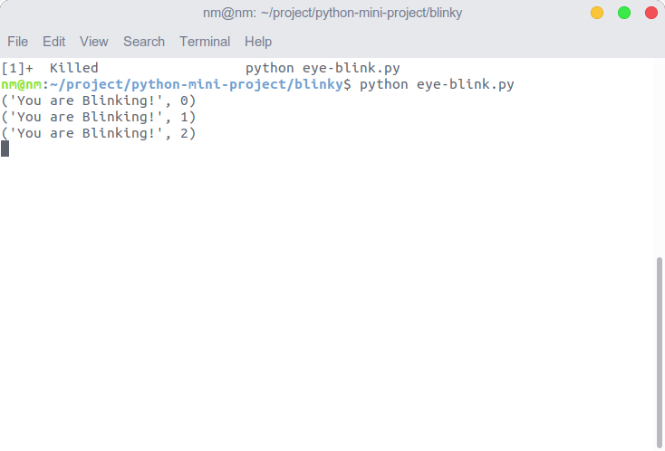
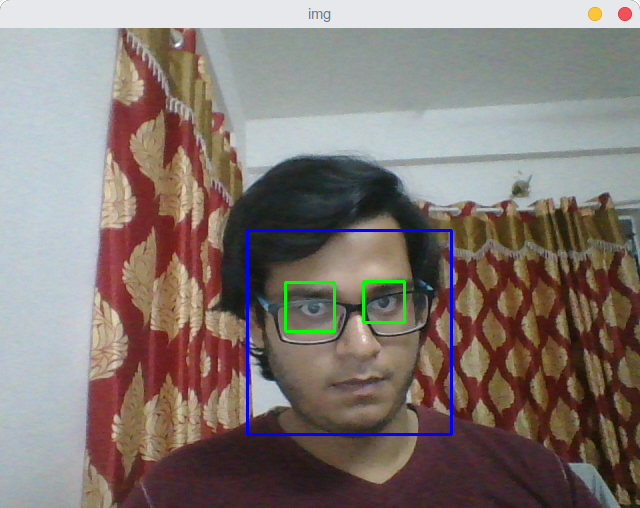

# Face and Blink Detection

# Overview

## Goal
1) In this demo we will find the facial landmarks, such as eyes, nose, mouth, ears, jaw-line using the popular [dlib](http://dlib.net/) library
2) We will see the basics of face detection using Haar Feature-based Cascade Classifiers
3) We will extend the same for eye detection etc.
4) We also detect the blink counts and upload the count data to the firebase console.


# Dependencies
```pip install -r requirements.txt
   opencv
   numpy
   webcam
```

You also need shape detector, you can download it by 
```
wget http://dlib.net/files/shape_predictor_68_face_landmarks.dat.bz2
```
# Usage
 ```
 1) python facial_landmark_detection.py --shape-predictor shape_predictor_68_face_landmarks.dat --image images/nish.jpg
 2) python eye-blink.py
```
### Results





